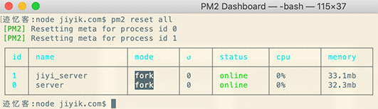

# pm2 教程
<!-- https://markdown.com.cn/basic-syntax/horizontal-rules.html -->
<!-- https://www.jiyik.com/w/pm2/pm2-applications-states -->

## pm2 基础

### pm2 管理状态
管理应用程序状态
使用 PM2，我们可以在后台轻松启动/重启/重新加载/停止/列出应用程序。分别对应的命令为:  
- start - 启动程序  
- restart - 重启程序  
- reload - 重新加载  
- stop - 停止  
- list - 列出应用程序  

在接下来的介绍中，我们新建一个 server.js，后续都使用该文件作为示例。内容如下：  
```javascript
var http = require('http');

http.createServer(function (request, response) {

    // 发送 HTTP 头部 
    // HTTP 状态值: 200 : OK
    // 内容类型: text/plain
    response.writeHead(200, {'Content-Type': 'text/plain'});

    // 发送响应数据 "Hello World"
    response.end('Hello World\n');
}).listen(8080);

// 终端打印如下信息
console.log('Server running at http://127.0.0.1:8080/');
```

#### Start
使用以下命令启动一个应用程序
```bash
$ pm2 start server.js
```


打开浏览器，在地址栏输入 http://127.0.0.1:8888 ，查看结果如下：


我们还可以启动任何类型的应用程序，如 bash 命令、脚本、二进制文件：
```bash
$ pm2 start "npm run start"
$ pm2 start "ls -la"
$ pm2 start app.py
```

#### 启动并显示日志流
要启动应用程序并检查日志流，使用 --attach 选项：
```bash
$ pm2 start server.js --attach
```

通过 Ctrl-C 退出时，应用程序仍将在后台运行。

#### 参数传递

在 -- 之后传递的所有选项将作为参数传递给应用程序：
```bash
$ pm2 start server.js -- arg1 arg2
```

#### 配置文件

当同时管理多个应用程序或必须指定多个选项时，可以使用配置文件。

```javascript
// server.config.js
module.exports = {
  apps : [{
    name   : "server",
    script : "./server.js",
    args   : "server1"
  },{
    name   : "jiyi_server",
    script : "./jiyi_server.js",
    args   : "server2"
  }]    
}
```

然后启动这两个应用程序：
```bash
$ pm2 start server.config.js
```

阅读有关配置文件的更多信息。

#### Restart
使用以下命令重新启动应用程序：

```bash
$ pm2 restart server
```


使用以下命令重启所有的应用程序

```bash
$ pm2 restart all
```

一次启动多个应用程序

```bash
$ pm2 restart app1 app2 app3 
```

要更新环境变量或 PM2 选项，请指定 --update-env CLI 选项：
```bash
$ NODE_ENV=production pm2 restart web-interface --update-env
```

#### Stop
使用以下命令停止应用程序

```bash
$ pm2 stop server
```


停止所有的应用程序

```bash
$ pm2 stop all
```

一次性停止多个指定的应用程序
```bash
$ pm2 stop app1 app2 app3
```

#### ls 列出所有的应用程序
使用以下命令列出所有的运行中的应用程序
```bash
$ pm2 ls
# 或者
$ pm2 [list|ls|l|status]
```


还可以指定希望应用程序列出的顺序：

```bash
$ pm2 list --sort name:desc
# 或者
$ pm2 list --sort [name|id|pid|memory|cpu|status|uptime][:asc|desc]
```


#### Delete 删除应用程序
要停止和删除应用程序，可以使用以下命令

```bash
$ pm2 delete server
```


使用以下命令删除所有的应用程序
```bash
$ pm2 delete all
```


#### 终端监视器
PM2 提供了一种监视应用程序资源使用情况的简单方法。 我们可以通过终端轻松直接地监控内存和 CPU：
```bash
$ pm2 monit
```


#### 显示应用程序的 metadata
要显示有关应用程序的元数据：
```bash
$ pm2 show server
```


#### 重置重启次数
首先我们看一下当前各个应用程序重启的次数
```bash
$ pm2 ls
```


使用以下命令重置重启的次数，然后查看当前重启的次数
```bash
$ pm2 reset all
```


