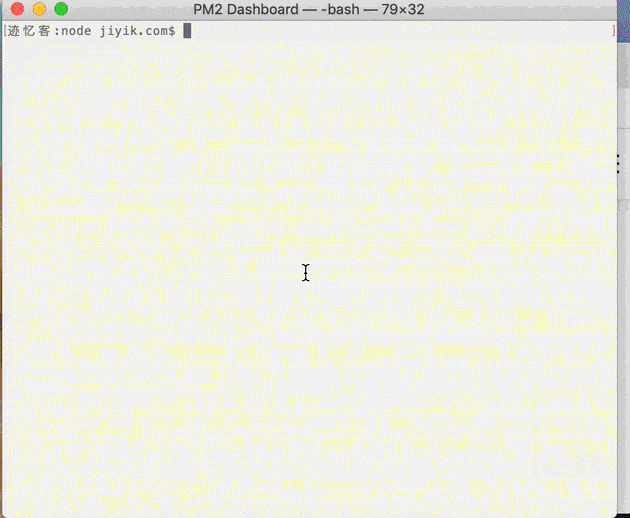

# pm2 重启策略（restart strategies）

使用 PM2 启动应用程序时，应用程序会在自动退出、事件循环为空 (node.js) 或应用程序崩溃时自动重新启动。 但您也可以配置额外的重启策略，例如：  
- 使用定时任务重新启动应用程序
- 文件更改后重新启动应用程序
- 当应用程序达到内存阈值时重新启动
- 延迟启动和自动重启
- 默认情况下，在崩溃或退出时禁用自动重启（应用程序始终使用 PM2 重启）
- 在特定的指数增长时间自动重启应用程序

---

## 使用定时任务重新启动应用程序
使用以下命令设置定时重启的任务
```bash
$ pm2 start server.js --cron-restart="0 0 * * *"
# 或者在重启的时候设置定时任务
$ pm2 restart app --cron-restart="0 0 * * *"
```

如果是通过配置文件的话，使用 cron_restart 属性：
```javascript
// server.config.js
module.exports = {
  apps : [{
    name: 'server',
    script: 'server.js',
    instances: 1,
    cron_restart: '0 0 * * *',
    env: {
      NODE_ENV: 'development'
    },
    env_production: {
      NODE_ENV: 'production'
    }
  }]
}
```

---

## 文件更改后自动重新启动应用程序
当前目录或其子目录中的文件被修改时，PM2 可以自动重新启动您的应用程序：  
使用以下命令，通过在后面指定选项 --watch 开启应用程序
```bash
$ pm2 start server.js --watch
```
下面我们通过gif动图演示该情况


注意：如果应用程序使用 --watch 选项启动，停止应用程序不会阻止它在文件更改时重新启动。 要完全禁用 watch 功能，需要执行下面的命令：
```bash
$ pm2 stop app --watch 
```
或者使用下面命令在应用程序重新启动时切换 watch 选项。
```bash
$ pm2 restart app --watch 
```
在配置文件中，使用 watch: true 属性
```javascript
module.exports = {
  script: "server.js",
  watch: true
}
```
我们还可以在配置文件中指定要监听哪个文件夹，当其内容有修改的时候自动重启应用程序。还可以指定忽略某些文件夹，不管其内容如何改变都不会触发重启
```javascript
module.exports = {
  script: "server.js",
  // 指定监听的文件夹
  watch: ["server", "client"],
  // 指定延迟时间
  watch_delay: 1000,
  // 指定要忽略的文件夹
  ignore_watch : ["node_modules", "client/img"],
}
```

---

## 当应用程序达到内存阈值时重新启动
PM2 允许根据内存限制重新加载（如果不在集群中，则自动回退重启）应用程序/请注意 PM2 内部工作程序（检查内存）每 30 秒启动一次，因此达到内存阈值后，可能需要稍等片刻 进程会自动重新启动。  
使用 --max-memory-restart 选项指定内存阈值。
```bash
$ pm2 start server.js --max-memory-restart 300M
```
配置文件中使用 max_memory_restart 属性。

```javascript
module.exports = {
  script: 'server.js',
  max_memory_restart: '300M'
}
```
> 注意：单位可以是 K(ilobyte)（例如 512K）、M（egabyte）（例如 128M）、G（igabyte）（例如 1G）。

---
## 延时重启
使用 Restart Delay 策略设置自动重启之间的延迟：
```bash
$ pm2 start server.js --restart-delay=3000
```
在配置文件中，使用 restart_delay 属性设置延时重启。
```javascript
// server.config.js
module.exports = {
  script: 'server.js',
  restart_delay: 3000
}
```

---
## 禁止自动重启
如果我们希望运行 1 次脚本并且不希望进程管理器在脚本完成运行时重新启动我们的脚本，这将非常有用。
```bash
$ pm2 start server.js --no-autorestart
```
在配置文件中，使用 autorestart: false 属性禁止自动重启。
```javascript
// server.config.js
module.exports = {
  script: 'server.js',
  autorestart: false
}
```

---
## 指定不自动重启的退出代码
有时我们可能希望应用程序在出现故障时自动重新启动（即非零退出代码），而不希望进程管理器在正确关闭时重新启动它（即退出代码等于 0）。  

在这种情况下，仍然可以很好地使用 PM2，并将 stop_exit_codes 选项设置为应该跳过自动重启的退出代码：  
```bash
$ pm2 start server.js --stop-exit-codes 0
```
在配置文件中，使用 stop_exit_codes 属性设置不用自动重启的退出代码。  
```javascript
// server.config.js
module.exports = [{
  script: 'server.js',
  stop_exit_codes: [0]
}]
```

---
## 指数退避重启延迟
在 PM2 Runtime 上实施了新的重启模式，使我们的应用程序以更智能的方式重启。 当异常发生（例如数据库关闭）时，不是疯狂地重新启动应用程序，指数退避重新启动将增加重新启动之间的时间，减少我们的数据库或外部提供程序的压力......非常易于使用：  

在终端命令行使用选项 --exp-backoff-restart-delay 设置此功能  
```bash
$ pm2 start app.js --exp-backoff-restart-delay=100
```
在配置文件中，使用 exp_backoff_restart_delay 属性。
```javascript
// server.config.js
module.exports = {
  script: 'server.js',
  exp_backoff_restart_delay: 100
}
```
当应用程序意外崩溃并激活选项 --exp-backoff-restart-delay 时，我们将能够看到新的应用程序状态 waiting restart。  
通过运行 pm2 logs，我们还将看到重新启动延迟增加：  
```text
PM2      | App [throw:0] will restart in 100ms
PM2      | App [throw:0] exited with code [1] via signal [SIGINT]
PM2      | App [throw:0] will restart in 150ms
PM2      | App [throw:0] exited with code [1] via signal [SIGINT]
PM2      | App [throw:0] will restart in 225ms
```
如你所见，重启之间的重启延迟将以指数移动平均线增加，直到达到重启之间的最大值 15000 毫秒。  
当应用程序返回到稳定模式（正常运行时间不超过 30 秒）时，重启延迟将自动重置为 0 毫秒。  