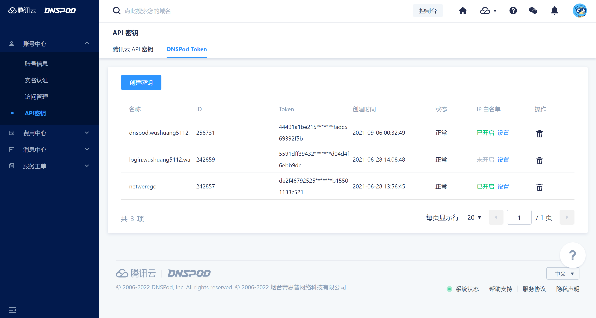
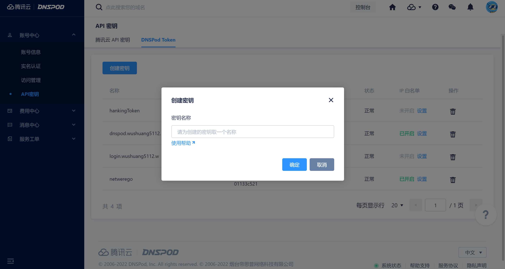
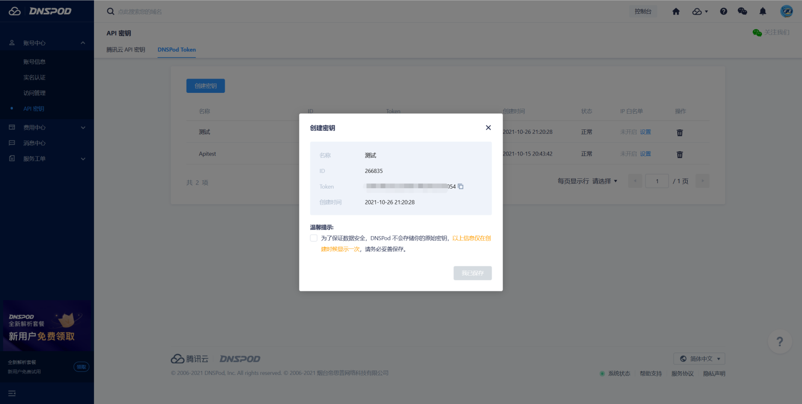
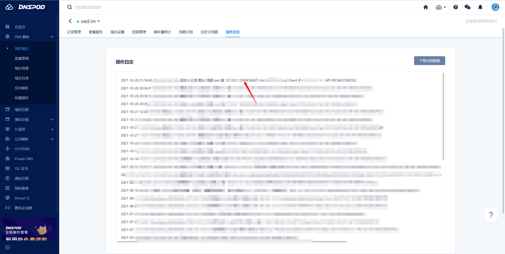
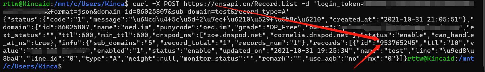
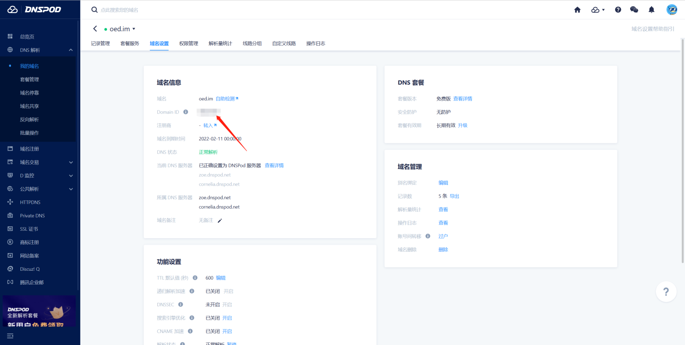
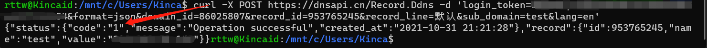
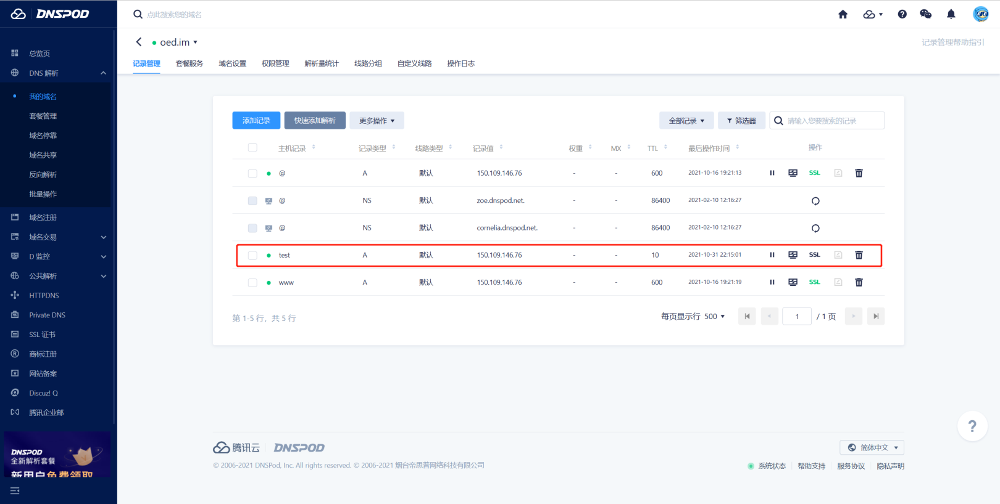
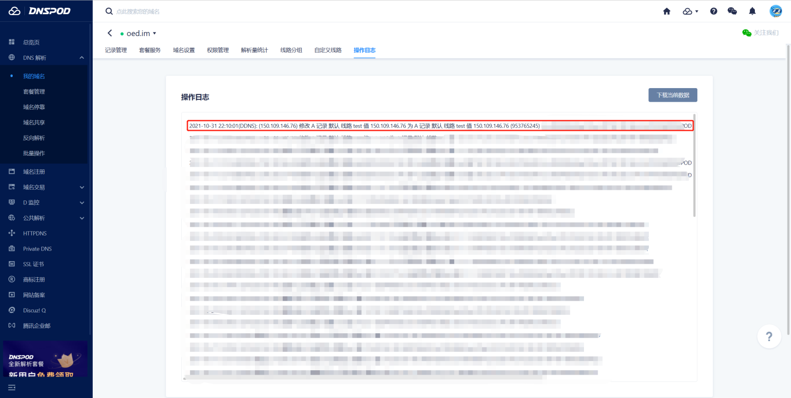

# 通过定时任务设置腾讯云DDNS

```text
1. 参数获取(API密钥/Token/域名ID/子域名ID)
2. 定时任务设置DDNS
3. DNSPod查看更新结果
```

## 1. 参数获取(API密钥/Token/域名ID/子域名ID)

> 注意这里一定要选择"DNSPod Token"而非"腾讯云API密钥"。

### 1.1 点击创建密钥，这里可能会进行安全验证，按照提示验证即可。


### 1.2 设置密钥名称，这里根据需要随便填就好。


### 1.3 记录密钥ID及Token
> 注意：Token仅在创建时展示一次，忘记的话请重新创建



### 1.4 获取子域名ID

### 1.4.1 通过控制台获取

#### 1) 通过控制台获取
> 在管理页面找到操作日志，“值”后面括号内数字极为记录ID   // 子域名ID, 推荐用方法



#### 2) 通过记录列表接口获取
> ssh连接服务器通过curl请求接口获取

```bash
# LOGIN_TOKEN：是由 ID,Token 组合而成的，用英文的逗号分割
# 若设置IPv6记录，请将record_type=A改为record_type=AAAA
# (暂不支持IPv6，先写着，毕竟马上就支持了)
curl -X POST https://dnsapi.cn/Record.List -d 'login_token=LOGIN_TOKEN&format=json&domain_id=域名ID&sub_domain=子域名&record_type=A'
```

例如:

```bash
curl -X POST https://dnsapi.cn/Record.List -d 'login_token=TokenID,Token&format=json&domain_id=86025807&sub_domain=test&record_type=A'
```

在返回数据中找到记录ID


## 2. 定时任务设置DDNS

### 2.1 获取"主域名ID"

> 通过定时任务+curl访问接口设置DDNS,受接口限制，暂不支持IPv6获取域名ID
登录控制台,找到并点击对应的域名，在管理页面找到并点击"域名设置"获取"域名ID"



### 2.2 测试DDNS接口相关参数是否正确

> ssh连接服务器通过curl请求接口测试

```bash
curl -X POST https://dnsapi.cn/Record.Ddns -d 'login_token=LOGIN_TOKEN&format=json&domain_id=域名ID&record_id=记录ID&record_line=线路类型&sub_domain=子域名&lang=en'
```
> 线路类型若无特殊需求默认即可

例如：
```bash
curl -X POST https://dnsapi.cn/Record.Ddns -d 'login_token=TokenID,Token&format=json&domain_id=86025807&record_id=953765245&record_line=默认&sub_domain=test&=en'
```
> LOGIN_TOKEN：是由 ID,Token 组合而成的，用英文的逗号分割。

当返回状态码为1时说明操作成功。


### 2.3 设置定时任务
> 这里以centos为例，其他系统除安装方式外配置方式大体相同，大家可自行通过搜索引擎查找。

#### 2.3.1 安装crontabs服务并设置开机自启

```bash
yum install crontabs
systemctl enable crond
systemctl start crond
```

#### 2.3.2 配置定时规则
```bash
crontab -e

# 在最后添加如下配置:
# 1 * * * * bash /data/syncNet/syncnet.sh
```

## 3. 查看结果

不出意外的话应该已经更新成功了，大家可以前往控制台查看效果。


<center>更新成功详情</center>


<center>更新成功日志</center>

> 原文链接: https://cloud.tencent.com/developer/article/1921363
